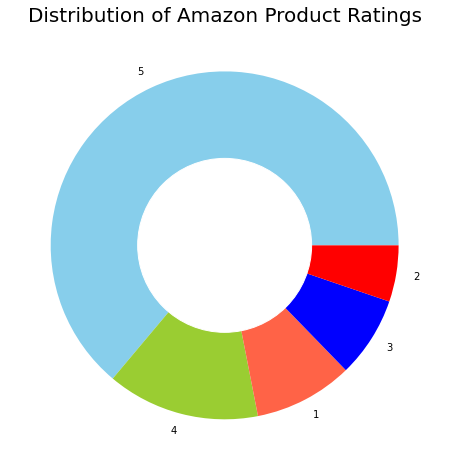
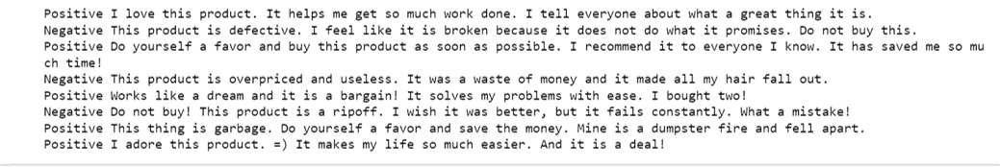

# Sentiment
This is an illustration how to do Sentiment Analysis on Amazon Fine Food Reviews on a dataset publically available from this site:
https://www.kaggle.com/datasets/snap/amazon-fine-food-reviews

The main purpose of Sentiment Analysis is to find out how the food reviewers feel about their food purchase.
In this repo I will like to find out 
1) The Food Review is rated from 1 to 5. How is the food rating distribution?
2) Can Python understand human feeling through words? How can we rate food reviews automatically, using the scale Positive, Neutral and Negative?

Amazon Food Review contains 500 000 lines of data
Out of these 500 000 lines the distribution of the Reviewers voting 1 to 5 are shown in the Figure below:

Rating food reviews automatically is one of the application NLP(Natural Language Processing). For this repo, we are demonstrating how this is done using VADER algorithm. As this algorithm takes up a lot of memory to execute for 500 000 lines, we have used a small subset of 10 lines to obtain a prelimary result.

On the left, the rating positive, negative or neutral is shown
On the right, the original food review made by customers of the product

Using positive and negative words, Vader rates the sentence written by each reviewer.

Thank you for reading this repo.
I can be reached as ngsugnee@gmail.com

